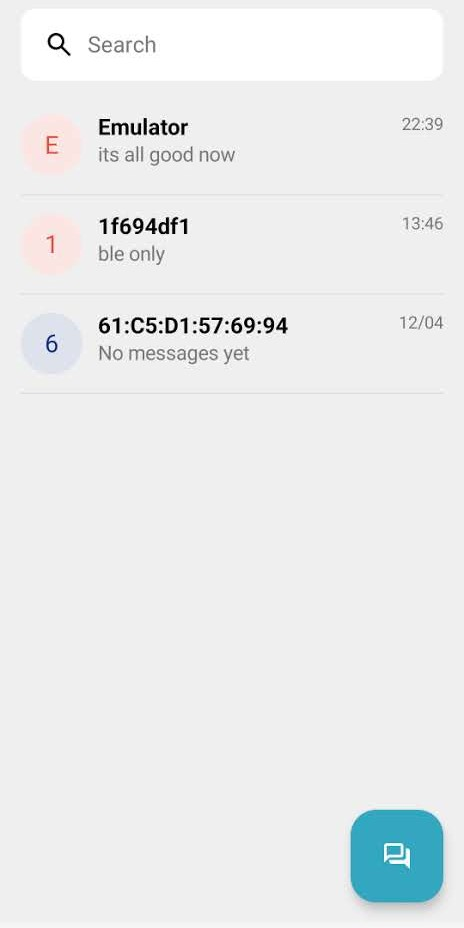
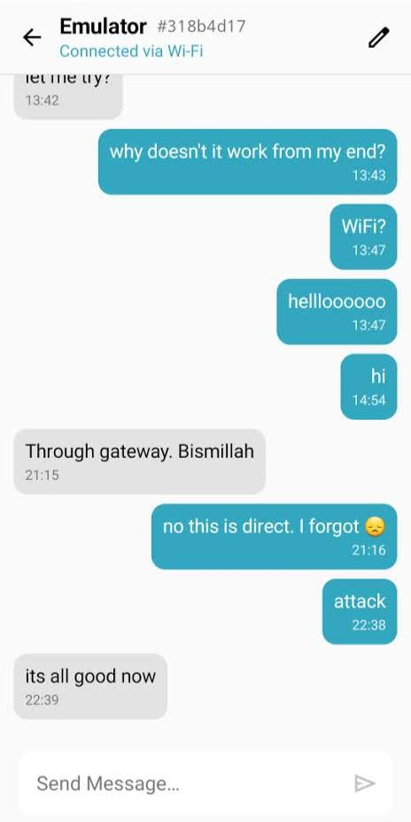
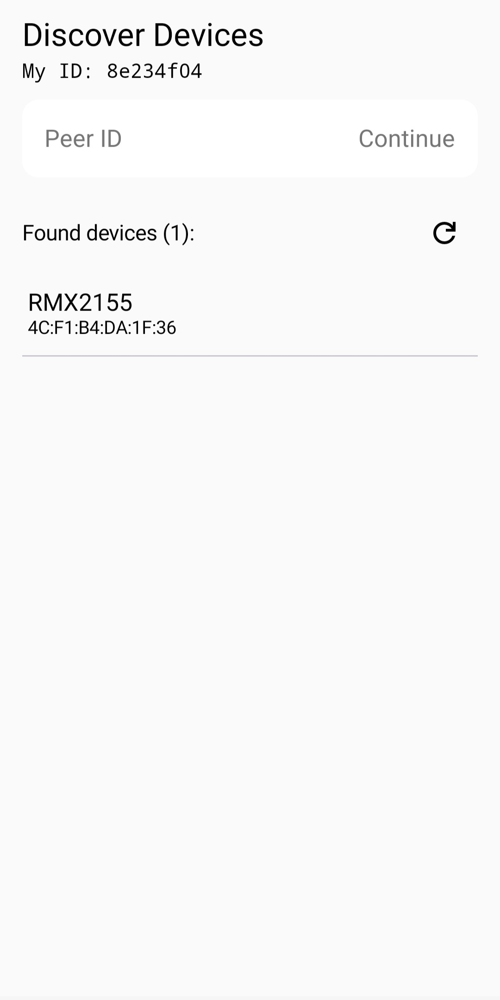

# BlueMesh

An Android messaging app for communicating when the internet is down or deliberately cut off. Phones relay messages to each other over **Bluetooth Low Energy** in a multi-hop mesh, and any phone in the mesh that *does* have internet automatically becomes a **gateway** to the outside world.

End-to-end encrypted. One-to-one. Works offline.


## Screenshots

<p align="center">
  
  
  
</p>


## Background

This project was motivated by the ongoing genocide in Gaza. Over 80% of Gaza's cell towers were destroyed in the first year, leaving Palestinians without internet for communication, emergency coordination, or contact with family. A handful of residents on the border managed partial connectivity via foreign SIM/eSIM, but that solution does not scale.

That raises the question this project tries to answer: **can people who still have connectivity share it with those who don't, through decentralised means that do not depend on cell towers?**

BLE-based mesh messaging apps exist (Briar, Bitchat, Bridgefy), but almost none bridge the offline mesh to the internet when one node happens to be online. BlueMesh closes that gap.


## Features

- **Offline BLE mesh** — phones discover each other, connect, and forward messages.
- **Dynamic gateway** — any mesh node with internet automatically becomes a gateway; offline phones never need to reach the internet themselves.
- **Automatic transport selection** — a direct send picks the best available path at the moment:
  1. Internet (if the server responds to a live health probe)
  2. Direct BLE to the recipient
  3. BLE flood to nearby nodes, where an online node forwards to the server
- **End-to-end encryption** — P-256 ECDH key agreement (Android Keystore, hardware-backed where available) → HKDF → AES-256-GCM. Ciphertext at rest and on the wire.
- **Persistent local history** — Room SQLite database keyed by peer identity; messages survive restarts and transport changes.
- **Stable peer identity** — 8-char hex ID independent of MAC address rotation.
- **Jetpack Compose UI** — Material 3, chat list, per-peer chat screen, live connection status, device discovery.


## Architecture


| Component                              | Role                                                                             |
| -------------------------------------- | -------------------------------------------------------------------------------- |
| `ChatTransportCoordinator`             | Picks a transport per session, manages outbound queue, tears down idle BLE links |
| `BleMessaging`                         | Role-aware send facade (central write / peripheral notify / HTTP / BLE flood)    |
| `ChatPayloadCrypto` + `E2eeIdentity`   | ECDH session-key derivation and AES-256-GCM encryption                           |
| `BluetoothHandler` / `BluetoothServer` | BLE central & peripheral roles                                                   |
| `RelayManager`                         | BLE flood, gateway-to-server forwarding, server-to-BLE reverse delivery          |
| `ServerClient`                         | HTTPS client with live server-health tracking                                    |
| `ChatHistoryRepository`                | Room-backed encrypted chat history                                               |


## Server

The gateway needs a small backend to hold messages for offline recipients and to queue BLE-relay deliveries.

- Source: [https://github.com/A-ElMahmi/BlueMesh-Server](https://github.com/A-ElMahmi/BlueMesh-Server)
- Hosted: [https://bluemesh-server.onrender.com/](https://bluemesh-server.onrender.com/)

The app speaks to the server over 4 authenticated endpoints:
`POST /message`, `GET /messages/{appId}`, `GET /relay-pending`, `POST /relay-confirm/{messageId}`. Every call carries an `X-API-Key` header.


## Build & Run

### Prerequisites

- **Android Studio** (Hedgehog or newer recommended)
- **JDK 17**
- **Android SDK 36** (compile/target); `minSdk` is 28 (Android 9 Pie)
- **Two physical Android devices** with BLE — emulators cannot advertise or be discovered, so BLE testing needs real hardware.
- Running (or hosted) instance of [BlueMesh-Server](https://github.com/A-ElMahmi/BlueMesh-Server) plus a valid API key.

### 1. Clone

```bash
git clone https://github.com/A-ElMahmi/BlueMesh.git
cd blessed-kotlin
```

### 2. Configure server credentials

Create `local.properties` at the repo root (or set environment variables — env takes precedence):

```properties
server.base.url=https://bluemesh-server.onrender.com
server.api.key=<your-api-key>
```

The app still builds without these, but all internet routing will fail silently and you'll only get direct BLE.

### 3. Build

```bash
./gradlew :app:assembleDebug
```

Or open the project in Android Studio and hit **Run**.

### 4. Install on two devices

```bash
./gradlew :app:installDebug
```

On first launch each device generates a persistent 8-character hex ID. Add the other device via **Discover** (BLE scan) or by typing its ID directly.

### Permissions

On first run you'll be prompted for:

- `BLUETOOTH_SCAN`, `BLUETOOTH_CONNECT`, `BLUETOOTH_ADVERTISE` (Android 12+)
- `ACCESS_FINE_LOCATION` (required by the BLE scan on Android 9–11)
- `INTERNET` (granted implicitly)

Bluetooth must be **on** — the app prompts to enable it if not.